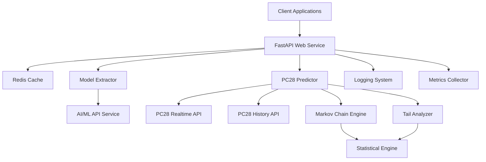

# Design Document

## Overview

The AI/ML API Model Extraction and PC28 Prediction System is designed as a microservices-based architecture that combines external API integration, statistical analysis, and machine learning prediction capabilities. The system uses FastAPI for the web service layer, Redis for caching, and implements custom algorithms for Markov chain analysis and statistical testing.

## Architecture

### High-Level Architecture



### Component Architecture

The system follows a modular design with clear separation of concerns:

- **API Layer**: FastAPI-based REST endpoints
- **Business Logic Layer**: Prediction algorithms and model extraction
- **Data Access Layer**: External API clients and caching
- **Infrastructure Layer**: Logging, metrics, and configuration

## Components and Interfaces

### 1. FastAPI Web Service (`main.py`)

**Responsibilities:**
- Expose REST API endpoints
- Handle request validation and response formatting
- Coordinate between different system components
- Manage caching strategies

**Key Endpoints:**
- `POST /predict`: Generate PC28 predictions
- `GET /models`: Retrieve AI/ML model catalog
- `GET /stats`: Return statistical analysis data
- `GET /metrics`: Provide system performance metrics
- `GET /health`: System health check

**Interface:**
```python
class PredictionAPI:
    def __init__(self, model_extractor, pc28_predictor, cache_client)
    async def predict() -> PredictionResponse
    async def get_models() -> ModelCatalogResponse
    async def get_stats() -> StatisticsResponse
    async def get_metrics() -> MetricsResponse
```

### 2. Model Extractor (`api_client.py`)

**Responsibilities:**
- Authenticate with AI/ML API services
- Fetch and parse model information
- Categorize models by type and capabilities
- Handle API rate limiting and errors

**Key Methods:**
```python
class ModelExtractor:
    def __init__(self, api_key: str, base_url: str)
    async def fetch_model_list() -> List[ModelInfo]
    def categorize_models(models: List[ModelInfo]) -> Dict[str, List[ModelInfo]]
    def validate_model_data(model: ModelInfo) -> bool
```

### 3. PC28 Predictor (`pc28_predictor.py`)

**Responsibilities:**
- Orchestrate the prediction workflow
- Fetch real-time and historical lottery data
- Coordinate between Markov engine and tail analyzer
- Generate final predictions with confidence scores

**Key Methods:**
```python
class PC28Predictor:
    def __init__(self, markov_engine, tail_analyzer, data_client)
    async def generate_prediction() -> PredictionResult
    def extract_features(raw_data: List[DrawResult]) -> List[FeatureSet]
    def combine_predictions(markov_probs, tail_adjustments) -> PredictionResult
```

### 4. Markov Chain Engine (`markov_model.py`)

**Responsibilities:**
- Build second-order transition matrices
- Calculate state transition probabilities
- Apply streak detection and adjustment logic
- Normalize probability distributions

**Key Methods:**
```python
class MarkovChainEngine:
    def build_transition_matrix(features: List[FeatureSet]) -> TransitionMatrix
    def predict_next_state(current_state_pair: StatePair) -> ProbabilityDistribution
    def apply_streak_adjustments(probs: ProbabilityDistribution, history: List[FeatureSet]) -> ProbabilityDistribution
    def normalize_probabilities(probs: ProbabilityDistribution) -> ProbabilityDistribution
```

### 5. Tail Analyzer (`tail_analyzer.py`)

**Responsibilities:**
- Calculate tail frequency distributions
- Perform chi-square goodness-of-fit testing
- Adjust prediction confidence based on statistical significance
- Apply tail-based probability adjustments

**Key Methods:**
```python
class TailAnalyzer:
    def analyze_tail_frequency(features: List[FeatureSet], window_size: int) -> TailFrequencyResult
    def chi_square_test(observed: List[int], expected: List[float]) -> ChiSquareResult
    def adjust_probabilities_by_tail(probs: ProbabilityDistribution, tail_freq: TailFrequencyResult) -> ProbabilityDistribution
    def calculate_confidence(p_value: float) -> float
```

### 6. Data Client (`data_client.py`)

**Responsibilities:**
- Handle authentication and request signing for PC28 APIs
- Fetch real-time lottery draw data
- Retrieve historical data with pagination
- Implement retry logic and error handling

**Key Methods:**
```python
class PC28DataClient:
    def __init__(self, api_key: str, app_id: str)
    def generate_signature(params: Dict[str, str]) -> str
    async def fetch_realtime_data() -> DrawResult
    async def fetch_history_data(date: str, limit: int) -> List[DrawResult]
    def validate_draw_data(data: DrawResult) -> bool
```

## Data Models

### Core Data Structures

```python
@dataclass
class DrawResult:
    period: str
    number: List[int]
    timestamp: datetime
    sum_value: int
    tail: int
    combination: str  # 大单, 小双, 小单, 大双

@dataclass
class FeatureSet:
    sum_value: int
    tail: int
    combination: str
    timestamp: datetime

@dataclass
class PredictionResult:
    sum_range: str
    combination: str
    probabilities: Dict[str, float]
    confidence: float
    tail_analysis: TailFrequencyResult
    timestamp: datetime

@dataclass
class ModelInfo:
    id: str
    name: str
    developer: str
    type: str
    context_length: int
    description: str
    features: List[str]
    url: str

@dataclass
class TailFrequencyResult:
    frequencies: Dict[int, float]
    chi_square_statistic: float
    p_value: float
    is_significant: bool
```

### Database Schema (Redis)

```
Keys:
- pc28_prediction:{timestamp} -> PredictionResult (TTL: 10s)
- model_catalog -> List[ModelInfo] (TTL: 24h)
- tail_stats:{date} -> TailFrequencyResult (TTL: 1h)
- prediction_history -> List[PredictionResult] (TTL: 7d)
- system_metrics -> MetricsData (TTL: 1h)
```

## Error Handling

### Error Categories and Strategies

1. **External API Errors**
   - Network timeouts: Retry with exponential backoff (max 3 attempts)
   - Authentication failures: Log error and return cached data if available
   - Rate limiting: Implement request queuing and delay mechanisms
   - Invalid responses: Validate data and fallback to default values

2. **Data Processing Errors**
   - Invalid lottery numbers: Skip invalid records and log warnings
   - Insufficient historical data: Use minimum viable dataset or return lower confidence
   - Statistical calculation errors: Fallback to uniform probability distribution
   - Cache failures: Continue without caching but log performance impact

3. **Prediction Engine Errors**
   - Matrix calculation failures: Use first-order Markov chain as fallback
   - Probability normalization errors: Apply equal probability distribution
   - Confidence calculation errors: Default to minimum confidence (0.50)

### Error Response Format

```python
@dataclass
class ErrorResponse:
    error_code: str
    message: str
    details: Optional[Dict[str, Any]]
    timestamp: datetime
    request_id: str
```

## Testing Strategy

### Unit Testing

- **Model Extractor**: Mock AI/ML API responses, test categorization logic
- **Markov Engine**: Test transition matrix calculations with known datasets
- **Tail Analyzer**: Verify chi-square calculations with statistical test cases
- **Data Client**: Mock external APIs, test authentication and retry logic

### Integration Testing

- **API Endpoints**: Test complete request/response cycles
- **Cache Integration**: Verify Redis operations and TTL behavior
- **External API Integration**: Test with sandbox/staging environments
- **Error Handling**: Simulate various failure scenarios

### Performance Testing

- **Load Testing**: 100 concurrent requests to /predict endpoint
- **Response Time**: Verify <2 second response time requirement
- **Memory Usage**: Monitor memory consumption under load
- **Cache Efficiency**: Measure cache hit rates and performance impact

### Accuracy Testing

- **Backtesting**: Test predictions against historical data
- **Statistical Validation**: Verify accuracy metrics over rolling windows
- **A/B Testing**: Compare different algorithm configurations
- **Confidence Calibration**: Validate confidence scores against actual accuracy

## Configuration Management

### Environment Variables

```python
# API Configuration
AIML_API_KEY = "9030c9fcbc474c258dca7ff39b3a20e6"
AIML_BASE_URL = "https://api.aimlapi.com/v1"
PC28_APP_ID = "45928"
PC28_REALTIME_URL = "https://rijb.api.storeapi.net/api/119/259"
PC28_HISTORY_URL = "https://rijb.api.storeapi.net/api/119/260"

# Redis Configuration
REDIS_HOST = "localhost"
REDIS_PORT = 6379
REDIS_DB = 0

# Algorithm Parameters
MARKOV_WINDOW_SIZE = 1000
TAIL_ANALYSIS_WINDOW = 16
PREDICTION_CACHE_TTL = 10
MODEL_CACHE_TTL = 86400

# Performance Targets
TARGET_RESPONSE_TIME = 2.0
TARGET_ACCURACY_COMBINATION = 0.60
TARGET_ACCURACY_SUM_RANGE = 0.67
CONFIDENCE_THRESHOLD = 0.05
```

### Configuration Validation

- Validate API keys and endpoints on startup
- Check Redis connectivity and performance
- Verify algorithm parameters are within acceptable ranges
- Test external API accessibility

## Security Considerations

### API Security

- Store API keys in environment variables, not in code
- Implement request rate limiting to prevent abuse
- Use HTTPS for all external API communications
- Validate and sanitize all input parameters

### Data Security

- Do not log sensitive API keys or authentication tokens
- Implement secure session management for any user authentication
- Use Redis AUTH if Redis instance is network-accessible
- Encrypt sensitive configuration data at rest

### Operational Security

- Implement comprehensive logging without exposing secrets
- Monitor for unusual API usage patterns
- Set up alerts for system failures and performance degradation
- Regular security updates for all dependencies

## Deployment Architecture

### Container Strategy

```dockerfile
# Multi-stage build for optimized production image
FROM python:3.11-slim as builder
# Install dependencies and build application

FROM python:3.11-slim as runtime
# Copy built application and run with non-root user
```

### Infrastructure Requirements

- **Compute**: 2 CPU cores, 4GB RAM minimum
- **Storage**: 10GB for logs and temporary data
- **Network**: Outbound HTTPS access to external APIs
- **Redis**: Dedicated instance with 1GB memory
- **Monitoring**: Prometheus/Grafana for metrics collection

### Scaling Considerations

- Horizontal scaling: Multiple API instances behind load balancer
- Cache scaling: Redis cluster for high availability
- Database scaling: Consider persistent storage for long-term analytics
- CDN: Cache static model catalog data for global distribution